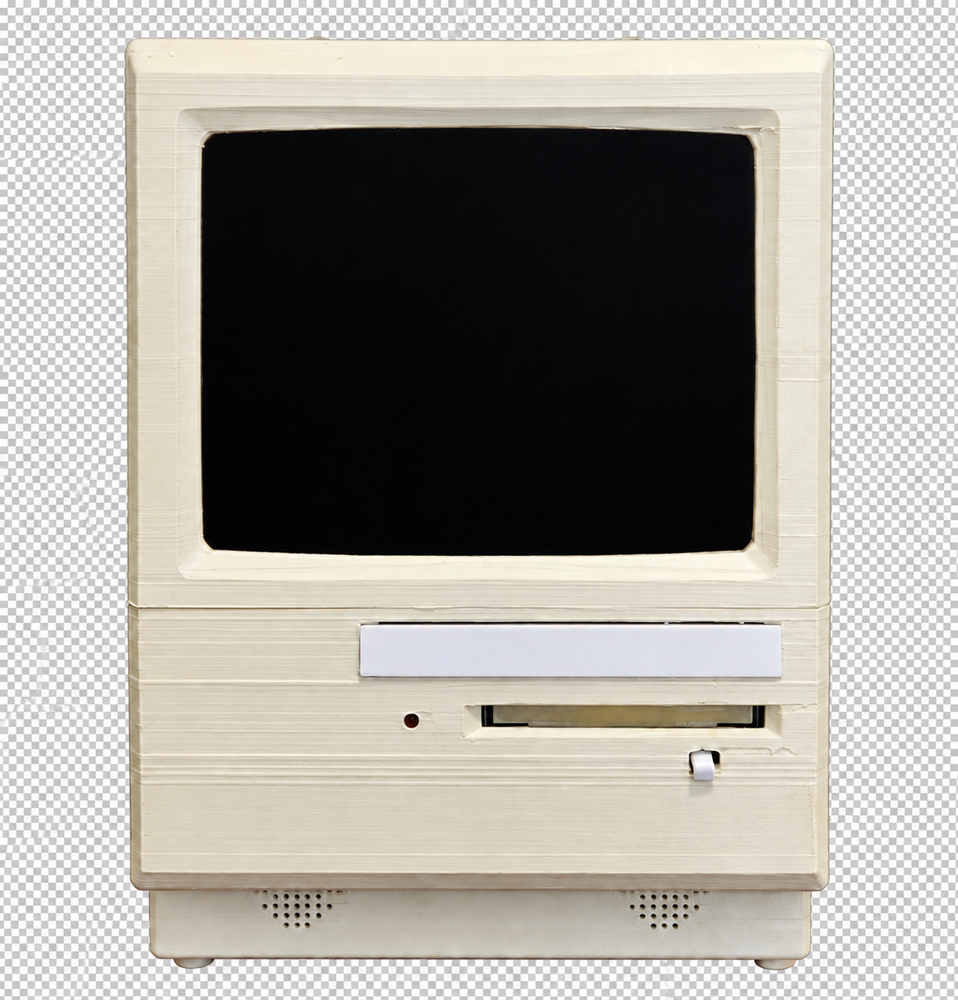
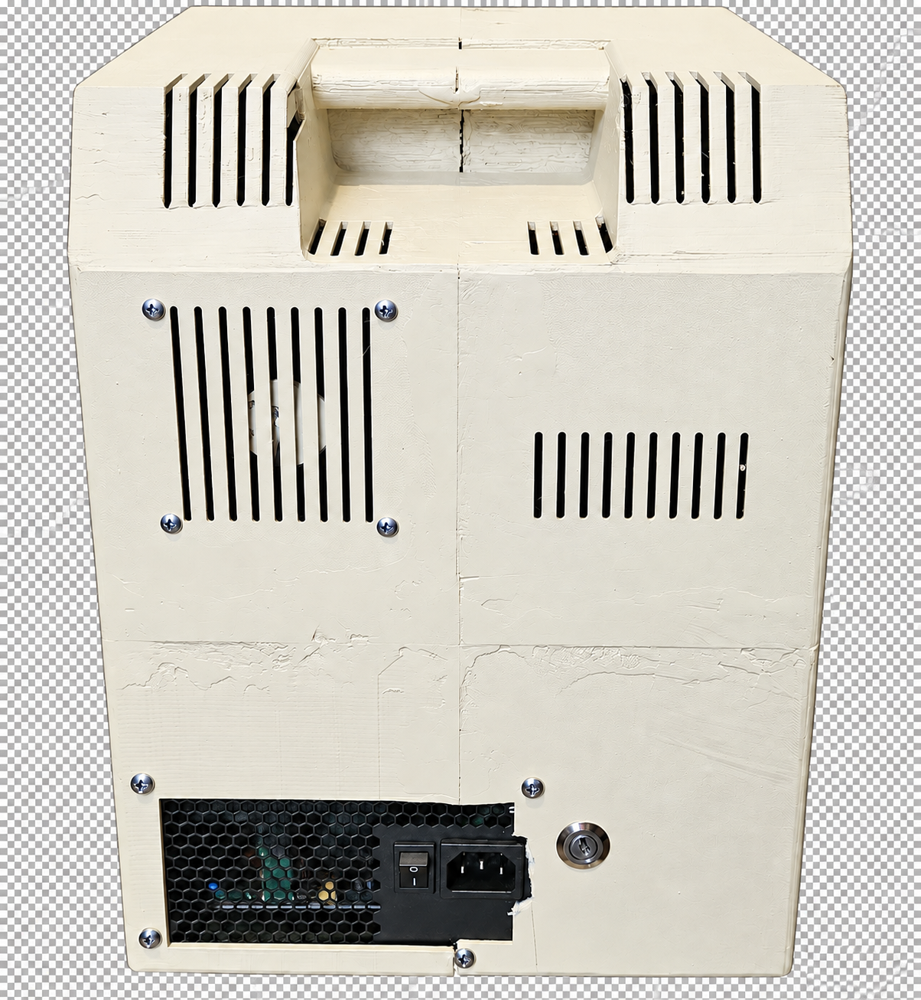
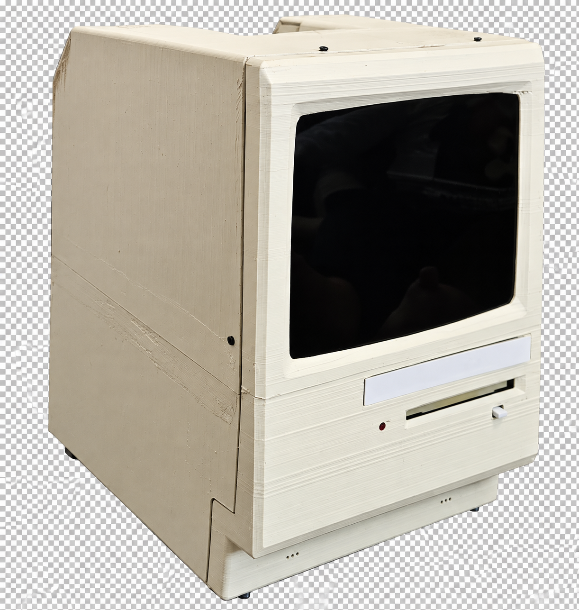
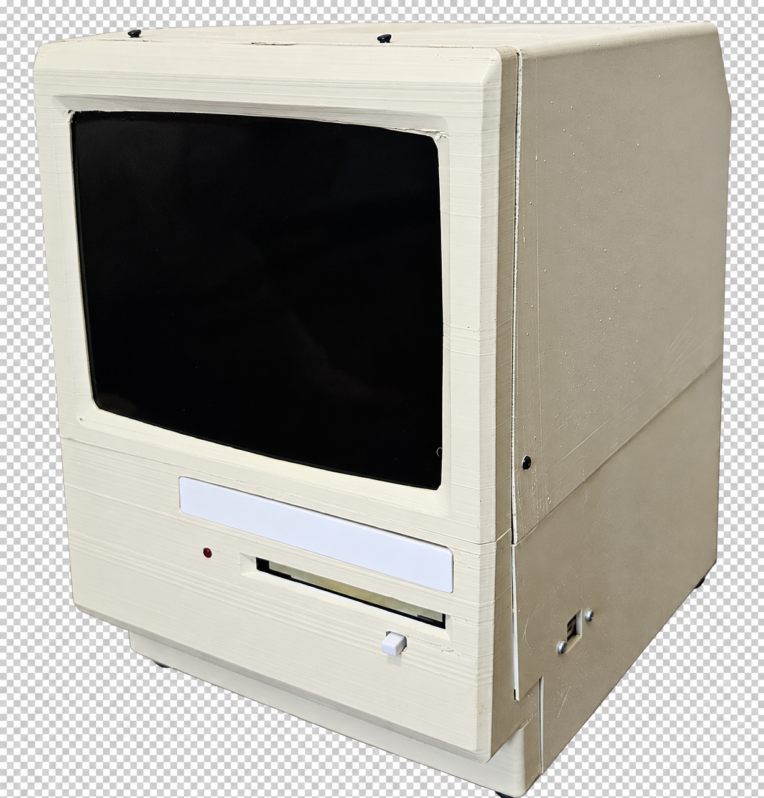

# RetroBox

RetroBox is a self-contained retro computer: a Debian appliance that boots
straight into [86Box](https://86box.net/) fullscreen and lets you choose
between three virtual PCs. It is designed to feel like a physical computer
from the 1980s and 1990s, with the flexibility of a modern emulator.

 Front  | Rear
:------------------:|:------------------:
 | 

## The project at a glance

The reference build uses an Intel Core i3-14100, 8 GB of RAM, integrated
graphics, and an MSI PRO H610M-S DDR4 motherboard. Everything is installed in
a 3D-printed Macintosh Classic-style case, together with a real floppy drive,
an optical drive, and an LCD panel.

The appliance includes three 86Box profiles:

| Profile | Intended use |
| --- | --- |
| 386SX-16 | DOS and early software; 54 MB blank disk. |
| Pentium 100 | Mid-1990s games, Sound Blaster, and CD-ROM. |
| Pentium II 350 | Windows 98 SE, Voodoo3 3000 AGP, AWE64 Gold, and an approximately 20 GB disk. |

On startup, RetroBox launches the default VM fullscreen. Press F12 to open a
text-based selector and switch machines without rebooting. The modified floppy
drive uses an ESP8266 and a PN532 reader: each floppy contains an NFC tag with
the image identifier, so inserting it automatically mounts the matching image
in 86Box. The physical CD-ROM can also be passed through to the VMs.

Left | Right 
:----:|:----:
 |  

## Use a prepared installation

Download the installer ISO from the [GitHub Releases](https://github.com/nakioman/retro-pc/releases)
page. Each release contains a hybrid installer that supports legacy BIOS and
UEFI.

1. Download `retropc-installer-*.iso` from the selected release.
2. Flash it to a USB drive with Raspberry Pi Imager, balenaEtcher, or an equivalent tool.
3. Boot the target computer from the USB drive and follow the installer.
4. Remove the USB drive and reboot when installation is complete.

The installer configures Wi-Fi when a compatible adapter is available and
detects the optical drive. The installed system uses a read-only root and
stores VMs, catalogs, and persistent configuration under `/data`.

> The installer may erase or repartition the selected disk. Use it on a
> dedicated machine and verify the target disk before confirming.

## Build your own RetroBox

This repository contains the source code, 86Box profiles, and fabrication files
needed to reproduce the project. You can build the reference system or adapt
the motherboard, display, power supply, and floppy drive to your own hardware.

### Macintosh Classic case

[`hardware/mac-classic-case/`](hardware/mac-classic-case/) contains the
parametric OpenSCAD model, rendered STLs, bill of materials, assembly guide,
and parameters for adapting the motherboard, power supply, LCD, drives, and
floppy drive. Every part fits on a 250 × 250 × 250 mm print bed.

```bash
mise run case-stl                 # all parts
mise run case-stl -- front-upper  # one part
```

### NFC floppy


[`hardware/floppy-nfc-blank/`](hardware/floppy-nfc-blank/) contains the
printable floppy model, NFC tag seat, bill of materials, parameters, and read
tests. The tag stores raw bytes in the `<id>,<mode>` format; it does not use
NDEF.

```bash
mise run floppy-stl
```

The reader electronics and firmware are in
[`firmware/retrofloppy-esp8266/`](firmware/retrofloppy-esp8266/README.md).

## Development

### Requirements and commands

- [mise](https://mise.jdx.dev/), which pins the project tools.
- Docker to build the ISO on macOS or Linux.
- An ESP8266 connected when compiling or flashing firmware.

```bash
mise install
mise run restore
mise run test
mise run format-check
```

You do not need to invoke `dotnet` directly; supported workflows go through
`mise`.

| Area | Location | Responsibility |
| --- | --- | --- |
| Core | [`src/RetroBox.Core`](src/RetroBox.Core) | YAML catalogs, VM selection, NFC, serial, and the 86Box socket. |
| CLI | [`src/RetroBox.Cli`](src/RetroBox.Cli) | `boot`, `daemon`, `vm`, `floppy`, `import`, and `nfc` commands. |
| Daemon/web | [`src/RetroBox.Daemon`](src/RetroBox.Daemon) | Floppy events, 86Box mounting, and the web panel. |
| Frontend | [`src/frontend`](src/frontend) | React/Vite panel, packaged by `RetroBox.Web`. |
| Firmware | [`firmware/retrofloppy-esp8266`](firmware/retrofloppy-esp8266) | NFC read/write over USB serial. |
| Appliance | [`appliance`](appliance/README.md) | Debian 13, systemd, read-only root, and USB installer. |
| Tests | [`tests/RetroBox.Tests`](tests/RetroBox.Tests) | xUnit tests. |

### Development loop

```bash
mise run frontend-install
mise run frontend-lint
mise run frontend-format-check
mise run frontend-build
mise run test
mise run format-check
```

Build the Linux x64 runtime and firmware:

```bash
mise run publish-linux-x64
mise run firmware-compile
mise run firmware-upload -- /dev/cu.usbserial-XXXX
```

### Build the installer ISO

```bash
docker build --platform linux/amd64 -t retropc-builder appliance/installer
docker run --rm --platform linux/amd64 --privileged \
  -v "$PWD:/work" retropc-builder \
  /work/appliance/installer/build-usb-installer.sh
```

The result is written to `appliance/installer/out/retropc-installer.iso`. The
GitHub Actions workflow performs the same build, publishes the artifact, and
attaches the ISO to each release. See
[`appliance/installer/README.md`](appliance/installer/README.md) for detailed
flashing, installation, and validation instructions.

## Technical documentation

- [`docs/architecture.md`](docs/architecture.md) — architecture and runtime flow.
- [`docs/vm-profiles.md`](docs/vm-profiles.md) — the three VM configurations.
- [`docs/floppy-controller-wiring.md`](docs/floppy-controller-wiring.md) — electronics.
- [`docs/cdrom-passthrough.md`](docs/cdrom-passthrough.md) — physical CD-ROM.
- [`docs/86box-floppy-control-socket-contract.md`](docs/86box-floppy-control-socket-contract.md) — 86Box protocol.
- [`hardware/mac-classic-case/README.md`](hardware/mac-classic-case/README.md) — case fabrication.
- [`hardware/floppy-nfc-blank/README.md`](hardware/floppy-nfc-blank/README.md) — NFC floppy fabrication.
- [`CONTRIBUTING.md`](CONTRIBUTING.md) — contribution and style guidelines.

## Contributing

Create a branch, add or update tests, run `mise run test` and
`mise run format-check`, and follow Conventional Commits. Important
architectural decisions are recorded in [`docs/decisions/`](docs/decisions/).

## License

The code is licensed under MIT; see [`LICENSE`](LICENSE). The case and floppy
also include the attributions and licenses for their original models.
