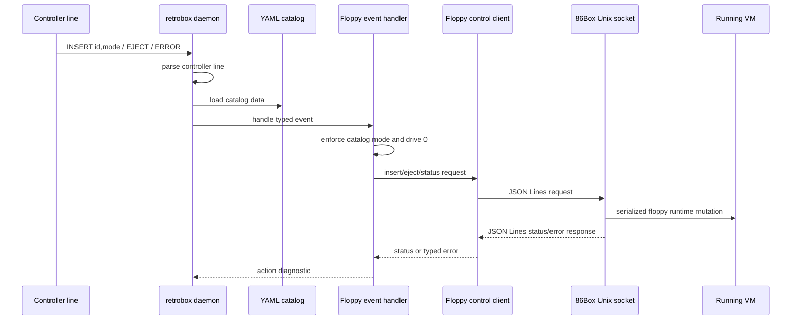
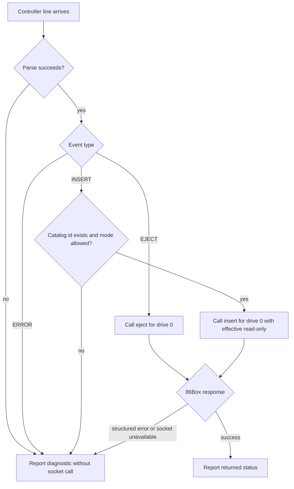

# 86Box Floppy Control Socket Closeout - Plan

## Goal Capsule

| Field | Value |
|---|---|
| Objective | Close the parent 86Box floppy-control integration by wiring the existing RetroBox pieces into the daemon path and proving the merged 86Box socket server works with the local contract. |
| Primary authority | GitHub issue `nakioman/retro-pc#6` and `docs/86box-floppy-control-socket-contract.md`. |
| Upstream state | `nakioman/86Box#2` is merged and child issues `#31`, `#13`, and `#15` are closed. |
| Execution profile | Standard cross-component closeout across CLI, daemon, core configuration, tests, and manual socket verification. |
| Stop conditions | Stop if live socket verification shows the merged 86Box server violates the contract in a way this repo cannot adapt around without reopening 86Box work. |
| Tail ownership | The implementer owns local tests, manual socket evidence, and any issue-update evidence needed to close parent issue `#6`. |

---

## Product Contract

### Summary

The remaining parent scope is not to reimplement the already-merged 86Box socket server, .NET client, or NFC event handler.
It is to make the `retrobox daemon` path consume the existing pieces in a usable way, reconcile the socket path/runtime configuration gap, and produce repeatable evidence that physical insert/eject events can drive `floppy.insert` and `floppy.eject` against the live 86Box socket.

### Problem Frame

Issue `#6` tracks the full runtime floppy-control integration, while its child issues delivered the server, client, and handler slices independently.
The current `retro-pc` repository still has a placeholder daemon command, so the parent issue can appear complete at the unit level while lacking a runnable closeout path and a repeatable integration proof.

### Requirements

**Contract and server authority**

- R1. The implementation must treat `docs/86box-floppy-control-socket-contract.md` as the local socket protocol authority for framing, commands, status shape, read-only behavior, and structured errors.
- R2. The implementation must treat merged upstream PR `nakioman/86Box#2` as the server-side implementation unless live verification finds a contract-breaking defect.
- R3. The integration must reconcile the local contract path `/run/retrobox/86box-floppy.sock` with the currently compiled test socket path `/Users/nacho/Games/86Box/86box.socket`.

**RetroBox runtime behavior**

- R4. The `retrobox daemon` path must load the YAML catalog, construct a floppy control client for the selected socket path, and route parsed controller events through the existing floppy event handler.
- R5. NFC `INSERT` events must call `floppy.insert` for drive `0` using the catalog image and effective read-only mode.
- R6. NFC `EJECT` events must call `floppy.eject` for drive `0`.
- R7. Catalog denied writes, unknown floppy IDs, parser failures, Arduino `ERROR` events, socket failures, and structured 86Box errors must produce diagnostics without crashing the daemon flow.
- R8. Read-only behavior must be enforced before calling 86Box when the catalog disallows writes, and live verification must confirm or record the effective 86Box read-only response.

**Closeout verification**

- R9. Local verification must prove the client, handler, daemon wiring, and CLI command surface through the repo's `mise` tasks.
- R10. Manual integration must probe the live 86Box socket for `floppy.status`, `floppy.insert`, `floppy.eject`, and representative error responses before issue `#6` is considered closable.

### Scope Boundaries

#### In Scope

- Wire the existing daemon command to real catalog/socket/event handling enough to exercise parsed controller lines.
- Add or extend focused tests around daemon construction, line handling, handler error behavior, and socket-path configuration.
- Add a durable manual verification note or checklist for the live 86Box socket.

#### Deferred to Follow-Up Work

- Real serial-port discovery and long-running hardware I/O beyond a testable line-input seam.
- Appliance-level systemd units, read-only root setup, and deployment packaging.
- Multi-drive configuration beyond the RTM drive `0` behavior.

#### Outside This Product's Identity For This Plan

- ESP8266 firmware.
- Samba import.
- Rewriting the merged 86Box socket server unless verification finds a blocking upstream defect.

### Acceptance Examples

- AE1. Given a cataloged read-only floppy and controller line `INSERT monkey1-disk1,ro`, when the daemon handles the line, then it calls `floppy.insert` for drive `0` with read-only enabled and reports the returned 86Box status.
- AE2. Given a cataloged read-write floppy and controller line `INSERT dos-save,rw`, when the daemon handles the line, then it calls `floppy.insert` for drive `0` with read-only disabled and reports the returned 86Box status.
- AE3. Given a cataloged read-only floppy and controller line `INSERT monkey1-disk1,rw`, when the daemon handles the line, then it reports a denied-write diagnostic and does not call 86Box.
- AE4. Given a running 86Box VM exposing `/Users/nacho/Games/86Box/86box.socket`, when `floppy.insert` and `floppy.eject` are sent over the socket, then the responses are JSON Lines status objects and the VM observes media change.
- AE5. Given invalid JSON, an unknown command, an invalid drive, and a missing image path, when each is sent to the live socket, then 86Box returns structured errors or closes the malformed frame as defined by the contract without crashing.

### Sources

- GitHub issue `nakioman/retro-pc#6`: parent scope and acceptance criteria.
- GitHub issues `nakioman/retro-pc#31`, `#13`, and `#15`: completed child scopes.
- GitHub PR `nakioman/86Box#2`: merged server-side socket implementation and validation notes.
- `docs/86box-floppy-control-socket-contract.md`: socket protocol contract.
- `docs/superpowers/specs/2026-07-28-retrobox-floppy-control-client-design.md`: client design.
- `docs/superpowers/specs/2026-07-28-wire-nfc-floppy-control-design.md`: handler design.

---

## Planning Contract

### Product Contract Preservation

Product Contract created from issue `#6`, the socket contract document, completed child issues, and the user's confirmed scope decision.

### Key Technical Decisions

- KTD1. **Treat the 86Box server as completed upstream** (session-settled: user-approved — chosen over reopening server-side implementation: merged PR `nakioman/86Box#2` exists, child issue `#31` is closed, and the user can run the compiled VM for live socket verification). This governs R2 and R10.
- KTD2. **Make the socket path configurable with fixed precedence.** The daemon uses a CLI override first, then a `floppyControlSocketPath` config value, then the contract default `/run/retrobox/86box-floppy.sock`; local/manual verification can target `/Users/nacho/Games/86Box/86box.socket` without hardcoding that path into appliance behavior.
- KTD3. **Use stdin as the first daemon line source before real serial I/O.** The current repo has a parser and handler but no serial-port event loop, so `retrobox daemon` should read controller lines from stdin for this closeout while real hardware I/O stays deferred; this governs R4 through R7.
- KTD4. **Verify all-drive status and server error behavior directly against 86Box.** The .NET client intentionally models single-drive status for app flows, while the parent contract also requires all-drive status and malformed-command handling; direct socket probes cover that server-level surface without expanding the client API.

### High-Level Technical Design

### Assumptions

- The compiled 86Box build the user can run includes `FLOPPY_CONTROL_SOCKET=ON` and has VM configuration enabling the socket.
- The parent closeout can require the user to start the VM before live socket verification; the implementation should not try to launch 86Box as part of this plan.
- Local tests should not depend on `/Users/nacho/Games/86Box/86box.socket`; that path is for manual verification only.

### Risks & Dependencies

- **Socket path drift:** The contract names `/run/retrobox/86box-floppy.sock`, while the merged 86Box PR defaults differently and the local test VM uses `/Users/nacho/Games/86Box/86box.socket`; KTD2 contains this by making the path configurable.
- **False parent completion:** Existing child tests prove the pieces independently, but the placeholder daemon can leave the actual parent flow unproven; U1 and U2 address that gap.
- **Manual verification dependency:** Live 86Box behavior cannot be fully proven by repo tests; U5 makes the manual step explicit and records what must be observed.

---

## Implementation Units

### U1. Wire Daemon Construction And Socket Configuration

- **Goal:** Make the `daemon` command construct a real RetroBox daemon with catalog loading and a configurable floppy-control socket path.
- **Requirements:** R3, R4, R9.
- **Dependencies:** None.
- **Files:** `src/RetroBox.Core/RetroBoxCatalogModels.cs`, `src/RetroBox.Core/RetroBoxConfigStore.cs`, `src/RetroBox.Cli/CliCommandFactory.cs`, `src/RetroBox.Daemon/RetroBoxDaemon.cs`, `tests/RetroBox.Tests/RetroBoxConfigStoreTests.cs`, `tests/RetroBox.Tests/CliHelpSmokeTests.cs`, `tests/RetroBox.Tests/RetroBoxDaemonTests.cs`.
- **Approach:**
  1. Add `floppyControlSocketPath` to `RetroBoxConfig` and the YAML config model.
  2. Add a daemon CLI socket option that overrides config for manual verification.
  3. Resolve socket path precedence as CLI override, then config value, then contract default.
  4. Replace the placeholder daemon command action with construction of the config store, floppy control client, and daemon object.
  5. Keep construction testable by isolating filesystem and client creation behind existing or new narrow seams.
- **Execution note:** Start with failing tests for socket-path defaulting and override behavior before changing the daemon command.
- **Patterns to follow:** `RetroBoxConfigStore` alternate-root pattern; `CliCommandFactory` option parsing and exception-to-exit-code pattern; xUnit tests using temporary catalog roots.
- **Test scenarios:**
  - Given a valid catalog without an explicit socket path, loading config and constructing the daemon uses the contract default socket path.
  - Given a config value for `/Users/nacho/Games/86Box/86box.socket`, daemon construction passes that path to the floppy control client factory without changing catalog image paths.
  - Given both a config socket path and a CLI socket option, daemon construction uses the CLI socket option.
  - Given invalid catalog files, invoking the daemon path returns a failure diagnostic and non-zero exit instead of throwing through the CLI.
  - Given `retrobox daemon --help`, the CLI help path exits successfully and shows the daemon command surface.
- **Verification:** The daemon command has a real construction path, tests prove default and override socket behavior, and existing CLI help smoke coverage still passes.

### U2. Add A Testable Daemon Line-Handling Flow

- **Goal:** Route controller text lines through parsing, catalog lookup, the existing event handler, and the floppy control client without opening real serial ports.
- **Requirements:** R4, R5, R6, R7, AE1, AE2, AE3.
- **Dependencies:** U1.
- **Files:** `src/RetroBox.Daemon/RetroBoxDaemon.cs`, `src/RetroBox.Daemon/RetroBoxFloppyEventHandler.cs`, `tests/RetroBox.Tests/RetroBoxDaemonTests.cs`, `tests/RetroBox.Tests/RetroBoxFloppyEventHandlerTests.cs`.
- **Approach:**
  1. Make `retrobox daemon` read controller lines from stdin until EOF or cancellation.
  2. Forward parsed events to `RetroBoxFloppyEventHandler` and surface the handler's action/message/status as daemon diagnostics.
  3. Keep real serial-port opening deferred; this unit proves the parent "NFC event can call 86Box" flow with parsed event input.
- **Execution note:** Use characterization-style tests around the existing handler behavior, then add daemon-level coverage for the line-to-handler handoff.
- **Patterns to follow:** `RetroBoxArduinoSerialProtocol.ParseEvent`; `RetroBoxFloppyEventHandlerResult`; fake `IRetroBoxFloppyControlClient` recording calls in handler tests.
- **Test scenarios:**
  - Covers AE1. Given `INSERT monkey1-disk1,ro` and a cataloged read-only floppy, the daemon calls the fake client insert path for drive `0` with read-only enabled and returns an inserted diagnostic.
  - Covers AE2. Given `INSERT dos-save,rw` and a cataloged read-write floppy, the daemon calls the fake client insert path for drive `0` with read-only disabled and returns an inserted diagnostic.
  - Covers AE3. Given `INSERT monkey1-disk1,rw` for a cataloged read-only floppy, the daemon returns a failed diagnostic and the fake client receives no calls.
  - Given `EJECT`, the daemon calls the fake client eject path for drive `0` and returns an ejected diagnostic.
  - Given `ERROR unreadable`, the daemon records an ignored controller diagnostic and the fake client receives no calls.
  - Given multiple stdin lines, the daemon handles them in order until EOF.
  - Given a malformed stdin line, the daemon reports a parse diagnostic and continues to the next valid line.
- **Verification:** Daemon-level tests prove parsed controller input reaches the same handler/client behavior that child issue `#15` tested directly.

### U3. Contain Client And Handler Failure Modes

- **Goal:** Ensure structured 86Box errors, socket unavailability, parser failures, and catalog failures are reported as daemon failures without crashing the flow.
- **Requirements:** R7, R8, R9.
- **Dependencies:** U1, U2.
- **Files:** `src/RetroBox.Core/RetroBoxFloppyControlClient.cs`, `src/RetroBox.Daemon/RetroBoxFloppyEventHandler.cs`, `src/RetroBox.Daemon/RetroBoxDaemon.cs`, `tests/RetroBox.Tests/RetroBoxFloppyControlClientTests.cs`, `tests/RetroBox.Tests/RetroBoxFloppyEventHandlerTests.cs`, `tests/RetroBox.Tests/RetroBoxDaemonTests.cs`.
- **Approach:**
  1. Preserve typed `RetroBoxFloppyControlException` details when 86Box returns structured errors.
  2. Convert expected client/socket/parser/catalog failures into daemon diagnostics at the boundary that owns user-visible flow control.
  3. Avoid swallowing cancellation or unexpected programming defects as normal floppy-control diagnostics.
- **Patterns to follow:** Existing typed exception shape in `RetroBoxFloppyControlClient`; existing handler `Failed` and `IgnoredError` actions; CLI error reporting style in import commands.
- **Test scenarios:**
  - Given a structured 86Box error response with code `invalid_drive`, the client throws `RetroBoxFloppyControlException` preserving code, message, and details.
  - Given the fake floppy client throws `RetroBoxFloppyControlException` with code `missing_image`, the handler or daemon returns a failed diagnostic including the stable code and does not crash.
  - Given the socket closes without a response, the client reports an `internal_failure` typed exception.
  - Given a malformed controller line, the daemon reports a parse diagnostic and the fake client receives no calls.
  - Given cancellation is requested before a socket operation, cancellation remains observable as cancellation rather than a normal failed floppy event.
- **Verification:** Error-path tests distinguish expected user/runtime failures from cancellation and preserve enough structured information to diagnose 86Box responses.

### U4. Document And Automate Parent Closeout Verification

- **Goal:** Add a durable parent-issue verification guide that ties local tests, CLI smoke, and live 86Box socket probes to issue `#6` acceptance criteria.
- **Requirements:** R1, R2, R8, R9, R10, AE4, AE5.
- **Dependencies:** U1, U2, U3.
- **Files:** `docs/86box-floppy-control-integration-verification.md`.
- **Approach:**
  1. Keep the socket contract as the protocol authority and add a separate verification guide rather than mixing closeout evidence into the contract body.
  2. Include local test gates, the manual VM-start checkpoint, socket path override guidance, and the expected request categories for status, insert, eject, invalid drive, missing image, unknown command, and malformed frame behavior.
  3. Record that all-drive `floppy.status` is verified directly against the socket because the app flow only needs single-drive status.
- **Execution note:** This unit is mostly documentation; prefer dry-run clarity and copy/paste correctness over adding unit tests for prose.
- **Patterns to follow:** Existing contract examples in `docs/86box-floppy-control-socket-contract.md`; issue `#31` manual transcript shape.
- **Test scenarios:** Test expectation: none -- this unit creates verification documentation and does not add executable behavior.
- **Verification:** A reader can follow the guide to run local tests, ask the user to start the VM, probe `/Users/nacho/Games/86Box/86box.socket`, and map each observation back to issue `#6`; `docs/86box-floppy-control-socket-contract.md` remains reference-only unless verification discovers real contract drift.

### U5. Execute Live Socket Verification And Capture Closeout Evidence

- **Goal:** Run the final manual integration against the user's running 86Box VM and capture the evidence needed to close issue `#6`.
- **Requirements:** R2, R8, R10, AE4, AE5.
- **Dependencies:** U4.
- **Files:** `docs/86box-floppy-control-integration-verification.md`.
- **Approach:**
  1. Ask the user to start the target VM when ready, then probe `/Users/nacho/Games/86Box/86box.socket`.
  2. Exercise all-drive status, single-drive status, insert, eject, read-only behavior, invalid drive, missing image, unknown command, and malformed JSON behavior.
  3. Update the verification guide with date-stamped observations or a concise evidence section suitable for the parent issue.
- **Execution note:** This unit depends on the user's live VM; do not block local code completion on the socket being available until this explicit verification step starts.
- **Patterns to follow:** Issue `#31` manual transcript; contract request/response examples.
- **Test scenarios:** Test expectation: none -- this unit is a manual integration verification pass against an external VM process.
- **Verification:** Live responses match the contract, the guest observes insert/eject media changes where applicable, and any mismatch is either documented as unsupported/blocked or escalated as an upstream 86Box defect.

---

## Verification Contract

| Gate | Applies To | Expected Outcome |
|---|---|---|
| `mise run test` | U1, U2, U3 | All .NET tests pass, including daemon wiring, handler, client, config, and CLI smoke coverage. |
| `mise run cli -- daemon --help` | U1 | The daemon command remains discoverable and exits successfully. |
| Manual 86Box socket probe at `/Users/nacho/Games/86Box/86box.socket` | U4, U5 | Status, insert, eject, read-only, and structured error probes produce contract-compatible behavior or a documented upstream blocker. |
| Parent issue evidence review | U5 | Issue `#6` acceptance criteria are each mapped to local tests, merged upstream PR evidence, or live socket observations. |

---

## Definition of Done

- U1 through U5 are implemented or completed in dependency order.
- `retrobox daemon` has a real construction and line-handling path for parsed controller events.
- Local tests cover daemon wiring, socket path configuration, handler/client failure behavior, and existing child-issue behavior without relying on a live 86Box process.
- The manual verification guide records how to run the live socket probes and what was observed.
- Live verification against `/Users/nacho/Games/86Box/86box.socket` has either passed or produced a clear upstream blocker with enough detail to reopen 86Box work.
- The final diff contains no dead-end experimental code from abandoned approaches.
