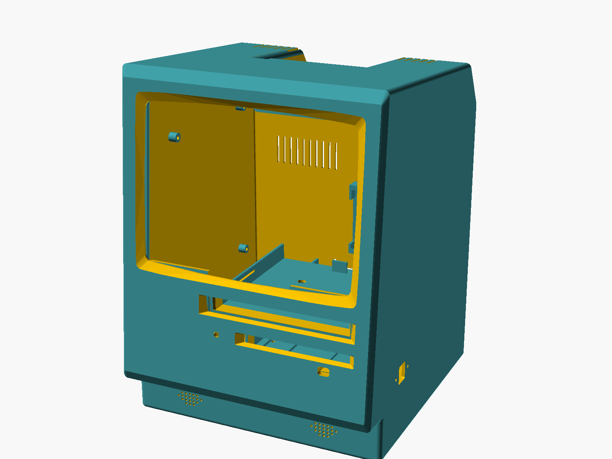

# Macintosh Classic case (3D printable)

A full-size (1:1) Macintosh Classic style case that houses the RetroBox PC:
a micro-ATX motherboard, a standard ATX power supply, a real 3.5" floppy
drive and a slim tray-load DVD drive behind the classic front slots, a 9.7"
retina LCD behind the screen window, and a 2.5" drive on the rear wall.

Source: [`mac-classic-case.scad`](mac-classic-case.scad). The shell geometry
is Jeroen Domburg's 1:6 [mini Mac](https://spritesmods.com/?art=minimac)
(beer-ware license, notice retained in the file), rescaled to 1:1 and
reworked into a working PC case. Every part fits a 250 × 250 × 250 mm bed:
the shell splits into front/back halves (original design), each half splits
horizontally, and the back pieces additionally split vertically.

## Layout

- **Motherboard** — micro-ATX (244 × 200) standing on edge against the left
  wall, components inward, IO shield facing the case front: IO block ends up
  top-front, expansion slots at the bottom. Printed standoffs with M3
  heat-set inserts.
- **PSU** — ATX (PS/2) on the floor, bottom right, tail against the rear
  wall: rear cutout + the real (asymmetric) ATX screw pattern. Floor stops
  keep it from shifting.
- **Drives** — a printed cage holds the floppy below and the slim DVD above,
  standing on two pedestals screwed to floor bosses. The drives slide in from
  the front and separate guide funnels bridge the gap to the sloped front
  slots. A printed cap replaces the floppy's eject button and a funnel-shaped
  cover glues to the DVD tray, with an invisible press-to-eject membrane.
- **Screen** — a 9.7" iPad 3/4 retina panel rests against the front's inner
  face, clamped by a printed frame that doubles as the structural bridge
  between the two front pieces. The HDMI driver board mounts on the right
  wall; its OSD button strip hides under the front chin, buttons pointing
  down.
- **Rear wall** — 2.5" drive in a printed cradle with a clip finger, 80 mm
  exhaust fan, passive vent slots, 16 mm power button.
- **Front details** — HDD activity LED next to the floppy slot, speaker
  grilles in the recessed bottom band (speakers glue behind them), dual USB-A
  on the right wall.

## Bill of materials

| Part | Notes |
| --- | --- |
| micro-ATX motherboard, 244 × 200 | Verified: Biostar H55 HD and MSI PRO H610M-S DDR4 (i3-14100, stock cooler). Check your board's holes against `mobo_hole_on`. |
| ATX (PS/2) power supply | Default fits up to 140 mm deep (`psu_depth` accepts more). Verified: EVGA 600W. |
| 3.5" PC floppy drive | Modeled on the NEC FD1231T **with its eject button removed** — the printed cap grips the bare eject lever (`fdd_latch`). |
| Slim SATA optical drive, 12.7 mm tray-load | Plus a slimline-SATA to SATA adapter cable. |
| 2.5" drive | HDD or SSD; the cradle takes 7–9.5 mm heights. |
| 9.7" iPad 3/4 retina panel (2048 × 1536) | Verified: Sharp LQ097L1JY01Z; LG LP097QX1 dimensions are the defaults. Measure `lcd_w/lcd_h/lcd_th/lcd_bottom_border` against your panel. |
| HDMI driver board kit for the LP097QX1 | The generic eDP kit with OSD button strip (107 × 16.5) and speaker output. |
| 2 × oval speakers, 20 × 30 mm | Driven by the LCD kit. Glued behind the front grilles. |
| 80 × 80 × 25 mm fan | Rear exhaust, 4 self-tapping M4 from outside. |
| Dual USB-A panel-mount connector | 30 mm screw centers; wired to a motherboard header. |
| 16 mm momentary panel-mount button | Power, wired to F_PANEL. |
| 5 mm red LED | HDD activity, wired to F_PANEL; press-fit + CA from behind. |
| 46 × M3 heat-set inserts | d4.0 × ≥6.5 (Ruthex/Voron standard). |
| M3 screws | ~24 pan head (cage, split joints, LCD frame), ~12 countersunk (front floor, HDD cradle, seam flaps), 2–4 into the floppy's threaded side holes. |
| M2 screws | 4, into the DVD drive's threaded side holes. |
| M2.5 self-tapping screws | 2–3 for the OSD strip. |
| #6-32 screws | 4 for the PSU (usually included with it). |
| Cyanoacrylate glue | Funnels, eject cap, DVD tray cover, speakers, LED, TPU feet, front seam. |
| PETG filament | Case parts. |
| TPU filament | The 4 feet. |

## Printed parts

Rendered STLs are committed under [`stl/`](stl/) — these are the exact files
the reference build was printed from. Regenerate any of them from the source
with `mise run case-stl -- <part> [...]` (no arguments renders all; the shell
pieces take a long time on OpenSCAD's CGAL backend).

Every part renders already oriented for printing. Reference build: PETG on an
Anycubic Kobra S1 (feet in TPU).

| Part | Piece | Print notes |
| --- | --- | --- |
| `front-lower` | Front shell, floor to z=146 | Supports: local, under the side-flap plates. |
| `front-upper` | Front shell with screen window and handle | Supports: local, under the top-flap plates (12 × 28, two spots) and the high side-flap plates. |
| `back-lower-left` / `back-lower-right` | Rear shell quarters with PSU cutout, floor bosses | Printed upright as rendered. |
| `back-upper-left` / `back-upper-right` | Rear shell quarters with vents, fan mount, handle | Lying on the flat rear wall. |
| `drive-cage` | Floppy + DVD bays | On its left face, no roof — bridges over the bays. |
| `cage-pedestals` | Both cage supports | Flat, no supports. |
| `fdd-funnel` / `dvd-funnel` | Front slot guides | Mouth down; supports touching the outside only, so the guiding interior stays clean. |
| `hdd-cradle` | 2.5" drive carrier with clip | Flat, no supports. |
| `lcd-frame` | Panel clamp frame | Flat, no supports. |
| `dvd-tray-cover` | Tray plug with eject membrane | Face down; the membrane prints as the first layers of the recess, no supports. |
| `eject-cap` | Floppy eject button | As rendered; the hook slot prints as an internal bridge. |
| `tpu-feet` | 4 floor feet | TPU, desk face on the bed. |

The `assembly`, `cutaway` and `cage-assembly` values of the `part` variable
are viewing modes for inspection (set `show_hardware = true` to preview ghost
hardware in place).

## Assembly

1. **Inserts.** Melt the 46 M3 inserts into every boss: motherboard
   standoffs, cage floor bosses, pedestal flanges, LCD frame bosses, split
   joints, seam flaps, HDD bosses, HDMI standoffs, front floor tabs.
2. **Back shell.** Join left/right lower quarters (vertical tongue + M3),
   the upper quarters the same way, then upper onto lower: the overlap ring
   seats and the L-tabs screw horizontally into the bosses from inside.
3. **Rear hardware.** Motherboard onto its standoffs, PSU (4 rear screws,
   floor stops locate it), fan, power button. Screw the HDD cradle over the
   split seam — it bridges the two rear pieces — and clip the drive in,
   SATA to the left.
4. **Drive cage.** Screw the pedestals to the floor bosses, then the cage
   base onto the pedestal flanges through the access holes in the DVD shelf.
   Slide both drives in from the front and fix them with their side screws
   (sliding slots let you set the depth). Glue the DVD funnel, then the
   floppy funnel, onto the bay mouths by their hug plates. With a diskette
   inserted, press the eject cap onto the bare eject lever and glue it. Glue
   the tray cover to the DVD tray by its two pads.
5. **Front shell.** Glue the two front pieces at the seam. Drop the panel
   into the LCD frame's centering pocket and screw the frame to the 6 bosses
   — it clamps the panel and bridges the front seam (the press bar also
   flattens any cage warp). Screw the OSD strip under the chin, glue the LED
   and the speakers.
6. **Close.** Route the PSU harness and USB cable through the left pedestal
   window, connect the panel, seat the front (the retainers center the cage)
   and screw it: 2 countersunk M3 from under the floor into the tabs, then
   the 6 seam flap screws (2 top, 2 low sides, 2 high sides).
7. **Feet.** Glue the TPU feet under the floor; the front pair pockets hide
   the floor screw heads.

## Parameters worth knowing

| Parameter | Default | Why you would change it |
| --- | --- | --- |
| `mobo_hole_on` | hole S off | Match your board's actual mounting holes. |
| `psu_depth` | `140` | Deeper PSUs exist (125–180). |
| `lcd_w/lcd_h/lcd_th/lcd_bottom_border` | LQ097L1JY01Z | Measure your panel before printing the front. |
| `hdd_sata_off` / `hdd_sata_from_bottom` | `10` / `true` | Align the cradle window with your drive's SATA block. |
| `fdd_latch` | FD1231T | Eject lever position; re-measure for another drive. |
| `odd_cover_gap` | `9.96` | Outer skin to DVD tray face; tune if the cover sits proud or sunken. |
| `odd_nub_gap` | `0.25` | Eject nub reach; lower if it doesn't click, raise if it self-triggers. |

## License

The case geometry derives from Jeroen Domburg's mini Mac and keeps its
beer-ware license notice in the source file.
